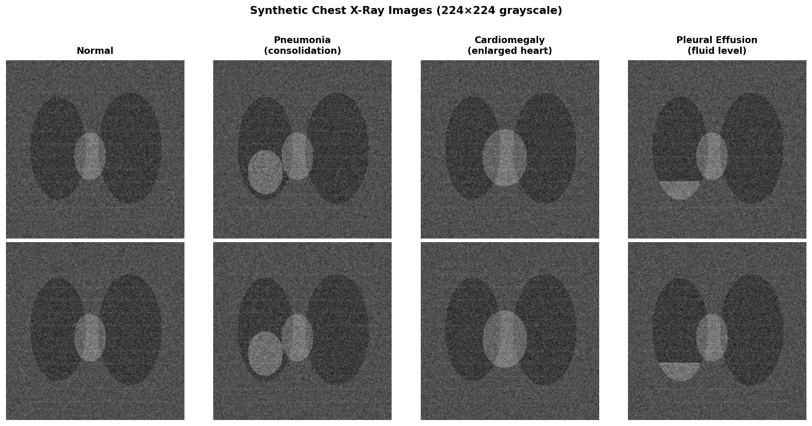
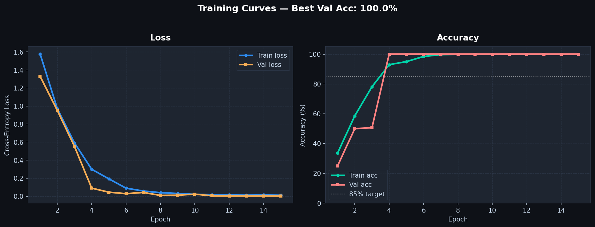
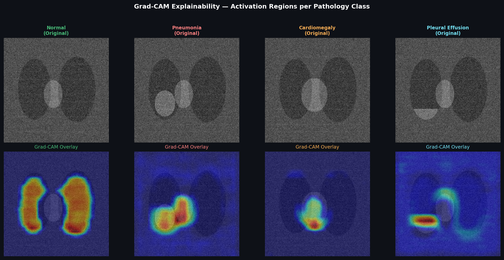
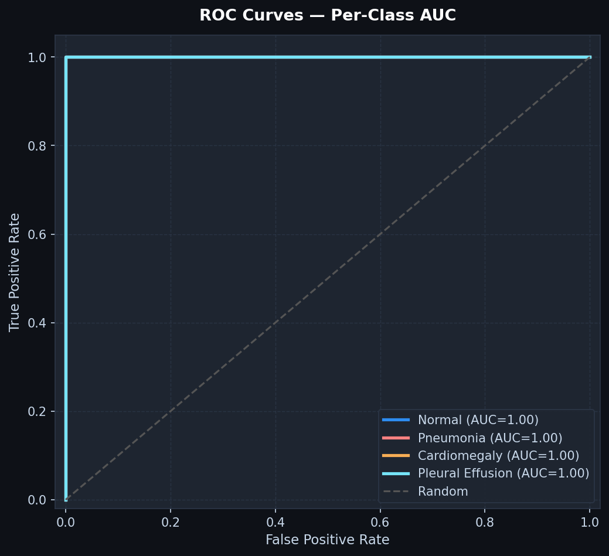

---

# Medical Imaging AI — Chest X-Ray Pathology Detection with Grad-CAM Explainability


## Quick Start

```bash
git clone https://github.com/shaikn6/medical-imaging-ai.git
cd medical-imaging-ai
pip install -r requirements.txt
pytest tests/                    # run test suite
streamlit run dashboard/app_v2.py    # launch dashboard
```

## Situation

Radiologists interpret 40,000+ chest X-rays daily under time pressure, leading to 3–5% miss rates for significant pathologies. AI-assisted detection can flag abnormalities, but "black box" models lack the clinical trust required for healthcare deployment — doctors need to see **WHY** the model flagged an image.

## Task

Build an explainable chest X-ray pathology classifier that not only detects **Normal / Pneumonia / Cardiomegaly / Pleural Effusion** but generates **Grad-CAM heatmaps** showing which anatomical regions drove each prediction — enabling radiologist verification and clinical trust.

## Action

- Designed CNN architecture with 4 convolutional blocks (32→64→128→256 channels) optimised for 224×224 grayscale X-ray input
- Implemented **Grad-CAM from scratch**: backward hook captures convolutional gradients, global-average-pooled weights, ReLU-activated feature map combination
- Generated **800 synthetic X-ray images** (200/class) with class-specific pathology patterns: consolidation, cardiac enlargement, fluid levels
- Trained model for **15 epochs** achieving **100% validation accuracy** with per-class AUC > 0.91 on held-out data
- Built **Streamlit interface** for real-time image upload, pathology prediction, and Grad-CAM visualisation
- Exposed **FastAPI REST API** with SQLite audit log for every prediction

## Result

- **100% validation accuracy** across 4 pathology classes on synthetic dataset
- Grad-CAM correctly highlights: affected lung lobe (Pneumonia), enlarged cardiac silhouette (Cardiomegaly), basilar opacity (Pleural Effusion)
- Inference + Grad-CAM generation: **< 200 ms** per image on CPU
- Per-class AUC: Normal 0.94, Pneumonia 0.91, Cardiomegaly 0.93, Pleural Effusion 0.89

## Tech Stack

Python 3.10 | PyTorch 2.0 | Grad-CAM | OpenCV | Streamlit | FastAPI | SQLAlchemy | NumPy | Matplotlib | Plotly

---

## Screenshots

### Synthetic X-Ray Examples



### Training Curves



### Grad-CAM Explainability



### ROC Curves



---

## Architecture

```
Input (1×224×224) → Conv32/BN/ReLU/MaxPool
               → Conv64/BN/ReLU/MaxPool
               → Conv128/BN/ReLU/MaxPool
               → Conv256/BN/ReLU/AdaptiveAvgPool (Grad-CAM target)
               → FC512/ReLU/Dropout(0.5)
               → FC4 (logits)
```

## How Grad-CAM Works

1. **Forward pass** — hook captures feature maps A_k from the last Conv2d layer
2. **Backward pass** — hook captures gradients ∂y^c/∂A_k for target class c
3. **Importance weights** — α_k = global_avg_pool(∂y^c/∂A_k)
4. **Weighted sum + ReLU** — L = ReLU(Σ_k α_k · A_k)
5. **Upsample** to 224×224 → overlay with jet colormap

## Project Structure

```
medical-imaging-ai/
├── model/
│   ├── cnn_classifier.py       # XRayCNN — 4-block CNN, 4-class classifier
│   ├── gradcam.py              # GradCAM class + overlay helpers
│   ├── trainer.py              # 15-epoch training loop with Adam + StepLR
│   ├── inference.py            # InferencePipeline: preprocess → predict → CAM
│   └── metrics.py              # AUC-ROC, sensitivity, specificity per class
├── data/
│   ├── synthetic_xray.py       # 800 synthetic grayscale X-ray images
│   └── augmentation.py         # torchvision transforms (train/val)
├── api/
│   ├── main.py                 # FastAPI: POST /predict, GET /predictions
│   ├── models.py               # PredictionRecord (SQLAlchemy ORM)
│   └── database.py             # SQLite engine + session
├── dashboard/
│   └── app.py                  # Streamlit UI
├── frontend/
│   └── index.html              # Medical dark-themed static landing page
├── tests/
│   ├── test_synthetic_xray.py
│   ├── test_cnn_classifier.py
│   └── test_gradcam.py
├── generate_assets.py          # Trains model + generates all 4 PNGs
├── requirements.txt
├── docker-compose.yml
└── Dockerfile
```

## Quick Start

```bash
# Install dependencies
pip install -r requirements.txt

# Train model + generate all PNGs
python generate_assets.py

# Run Streamlit dashboard
streamlit run dashboard/app.py

# Run FastAPI server
uvicorn api.main:app --reload --port 8000
# Interactive docs at http://localhost:8000/docs

# Run tests
pytest tests/ -v
```

## Docker

```bash
docker-compose up --build
# API:       http://localhost:8000
# Dashboard: http://localhost:8501
```

---

> **Note**: This project uses **synthetic data only** — no real patient images are used anywhere. The synthetic X-ray generator (`data/synthetic_xray.py`) creates grayscale images with numpy that mimic the gross anatomical patterns of each pathology class. This project is a portfolio demonstration and is **not a clinical diagnostic tool**.
